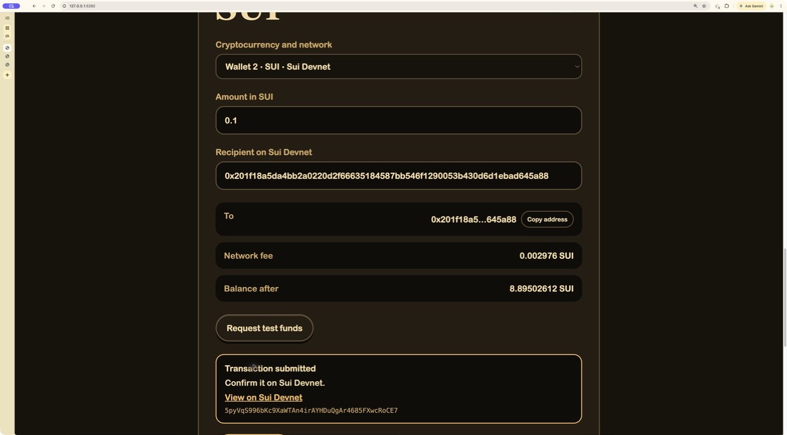
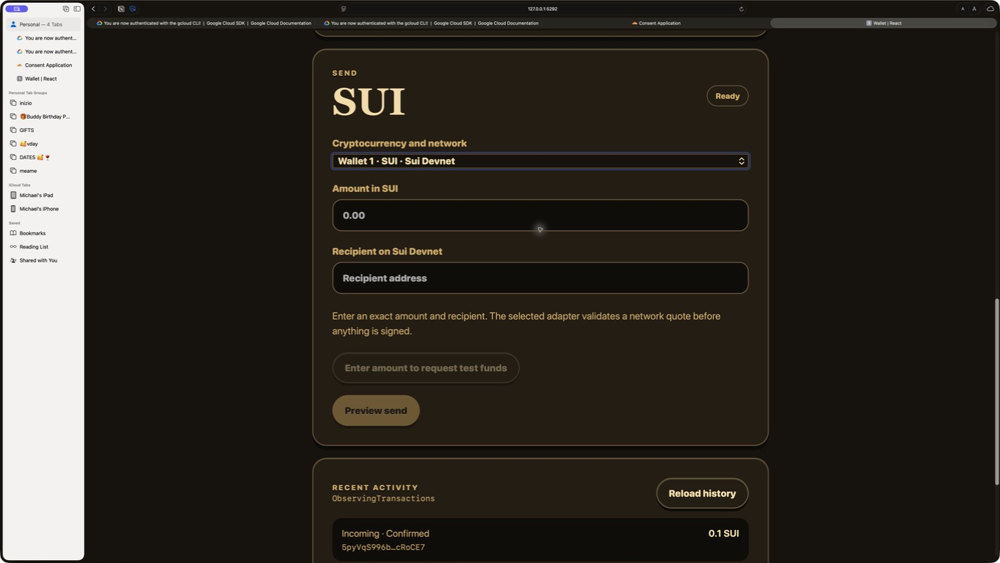
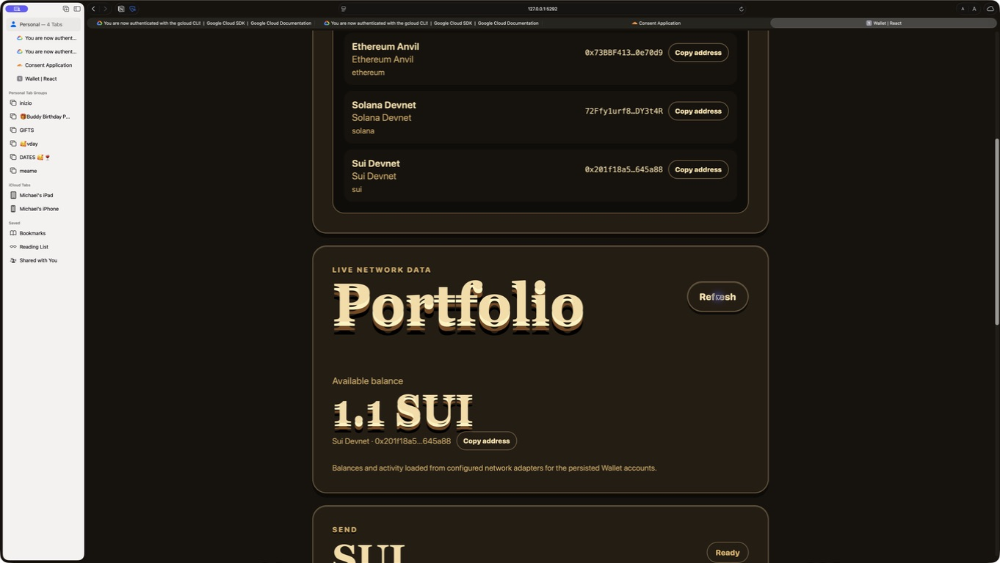
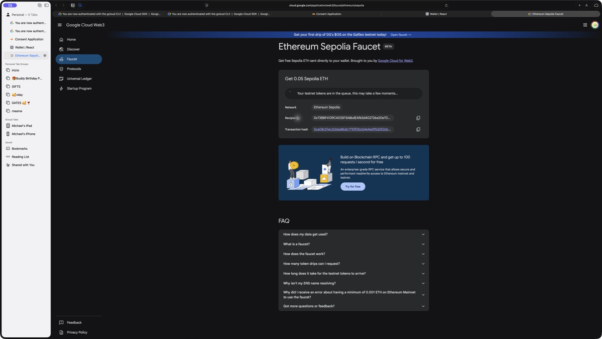
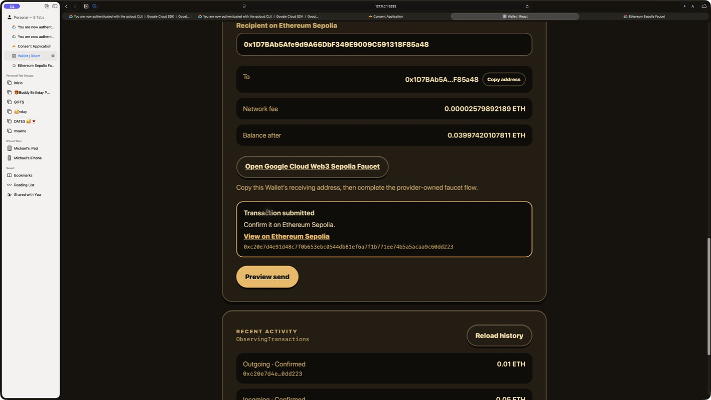
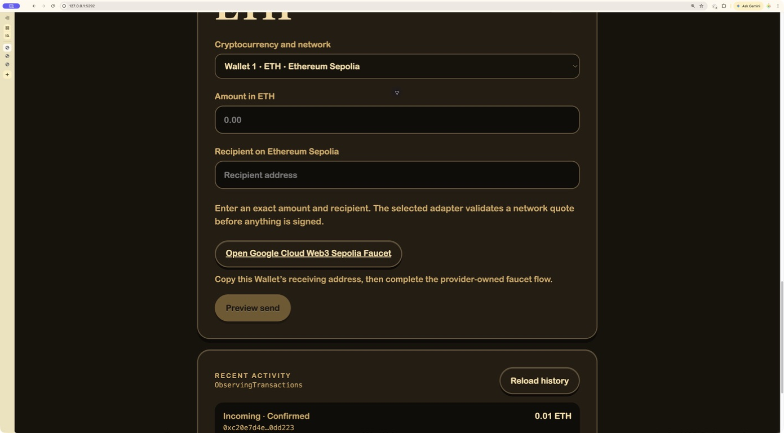
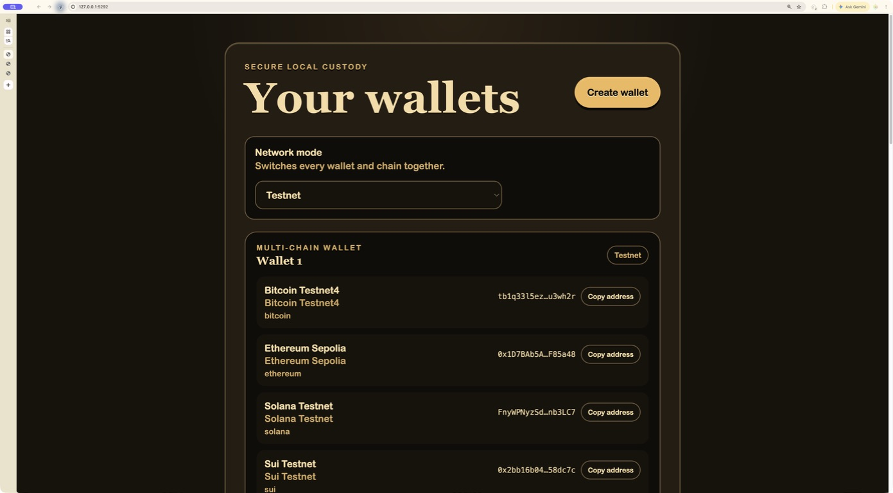

# Wallet | Verification matrix

This matrix separates executable contract coverage from real-network broadcast
evidence. A rail is never called live-verified merely because it compiled or
passed against a simulated transport. Mainnet broadcasts require explicit human
authorization and funded accounts.

## Rail contract

Every row uses the same portable `WalletProgram`, `SendNetworkSelection`,
transaction lifecycle, cursor history contract, and transaction Subscription.
The live catalog test constructs the executable adapter for all 12 rows. The
local custody test signs one structurally valid payload for each of the four
chain signing domains. Every history adapter rejects pages outside the portable
1-to-50 record bound at the generic contract boundary. The final sequential
verification run passed after the host-wide file-descriptor incident cleared.

| Cryptocurrency | Mode    | Network      | Build, sign, submit path | Test funding                                                                                          | Paginated history            | Near-real-time observation   | Real broadcast evidence                |
| -------------- | ------- | ------------ | ------------------------ | ----------------------------------------------------------------------------------------------------- | ---------------------------- | ---------------------------- | -------------------------------------- |
| Bitcoin        | Devnet  | Signet       | Implemented              | [Bitcoin Signet Faucet](https://bitcoinsignetfaucet.com/) handoff                                     | Esplora cursor               | Mempool websocket            | Not yet broadcast                      |
| Bitcoin        | Testnet | Testnet4     | Implemented              | [mempool.space Testnet4 faucet](https://mempool.space/testnet4/faucet) handoff                        | Esplora cursor               | Mempool websocket            | Not yet broadcast                      |
| Bitcoin        | Live    | Mainnet      | Implemented              | Unavailable by contract                                                                               | Esplora cursor               | Mempool websocket            | Not run, real funds                    |
| Ethereum       | Devnet  | Anvil        | Implemented              | Exact `anvil_setBalance` request                                                                      | Block and transaction cursor | Websocket blocks             | Awaiting local Anvil rerun             |
| Ethereum       | Testnet | Sepolia      | Implemented              | [Google Cloud Web3 faucet](https://cloud.google.com/application/web3/faucet/ethereum/sepolia) handoff | Blockscout cursor            | Websocket blocks             | Passed, faucet + transfer              |
| Ethereum       | Live    | Mainnet      | Implemented              | Unavailable by contract                                                                               | Blockscout cursor            | Websocket blocks             | Not run, real funds                    |
| Solana         | Devnet  | Devnet       | Implemented              | RPC airdrop                                                                                           | Signature cursor             | `logsSubscribe`              | Read smoke passed; airdrop unavailable |
| Solana         | Testnet | Testnet      | Implemented              | RPC airdrop                                                                                           | Signature cursor             | `logsSubscribe`              | Airdrop unavailable                    |
| Solana         | Live    | Mainnet Beta | Implemented              | Unavailable by contract                                                                               | Signature cursor             | `logsSubscribe`              | Not run, real funds                    |
| Sui            | Devnet  | Devnet       | Implemented              | Official network faucet                                                                               | GraphQL cursor               | Deduplicated GraphQL polling | Passed, two transactions below         |
| Sui            | Testnet | Testnet      | Implemented              | Official network faucet                                                                               | GraphQL cursor               | Deduplicated GraphQL polling | Faucet unavailable                     |
| Sui            | Live    | Mainnet      | Implemented              | Unavailable by contract                                                                               | GraphQL cursor               | Deduplicated GraphQL polling | Not run, real funds                    |

## Client modality

| Client          | Wallet and cryptocurrency selection | Devnet, Testnet, Live | Compose amount and recipient            | Test funding                              | Preview                           | Sign and submit  | Secure local custody  | History and observation                                    |
| --------------- | ----------------------------------- | --------------------- | --------------------------------------- | ----------------------------------------- | --------------------------------- | ---------------- | --------------------- | ---------------------------------------------------------- |
| React web       | On-screen dropdown                  | On-screen dropdown    | On-screen fields                        | Adapter request or external provider link | On-screen                         | On-screen        | Encrypted IndexedDB   | On-screen pages and Subscription                           |
| Foldkit web     | On-screen dropdown                  | On-screen dropdown    | On-screen fields                        | Adapter request or external provider link | On-screen                         | On-screen        | Encrypted IndexedDB   | On-screen pages and Subscription                           |
| React Native    | Native Picker                       | Native Picker         | Native fields                           | Adapter request or external provider link | On-screen                         | On-screen        | Expo SecureStore      | On-screen pages and Subscription                           |
| Raw CLI         | Exact flags or portable URI         | Exact argument        | Exact flags or portable URI             | `fund` request or exact provider handoff  | One-shot command                  | One-shot command | Native macOS Keychain | `history`, `history-next`, and proven Subscription Message |
| Effect Terminal | Keyboard selection                  | Keyboard cycle        | Interactive amount and recipient editor | `f` request or exact provider handoff     | Keyboard action                   | Keyboard action  | Native macOS Keychain | Reload, next-page, and proven Subscription Message         |
| OpenTUI React   | Select control                      | Select control        | F2 amount and F3 recipient inputs       | Adapter request or exact provider handoff | Select action or recipient submit | Select action    | Native macOS Keychain | Reload, next-page, and Subscription                        |

## Dynamic selection evidence

The browser matrix changed both Chrome and Safari from Testnet to Devnet and
back, selected different Wallets, and moved among Ethereum, Solana, and Sui.
The selected Wallet and chain were preserved when a matching rail existed.
Account, network, balance, recipient label, amount label, funding capability,
history query, observation, and transaction state rebound to the new exact
selection. Switching Wallet, cryptocurrency, or global mode clears stale
recipient, amount, preview, funding, transaction, history, observation,
clipboard, and signature state.

The three visual hosts use the same escaped selection identity, including mode,
chain, network, Wallet account, and asset. Delimiter-bearing normalized IDs
cannot collide in dropdown values or view keys. Journal restoration hydrates
the live account registry before resuming account-dependent finite work.

## Two-browser live evidence

On July 30, 2026, the final build completed two independent live flows.

### Sui Devnet

Chrome Wallet 2 sent 0.1 SUI to the separately persisted Safari Wallet 1. The
screen previewed a 0.002976 SUI fee. Sui accepted transaction
[`5pyVqS996bKc9XaWTAn4irAYHDuQgAr4685FXwcRoCE7`](https://suiscan.xyz/devnet/tx/5pyVqS996bKc9XaWTAn4irAYHDuQgAr4685FXwcRoCE7).
Safari added `Incoming · Confirmed 0.1 SUI` without a reload, then refreshed to
1.1 SUI. The earlier 1 SUI transaction
[`39vnpUk6vPwvJVaTPJqZXX9hnH2Bip22GAtzGaHZNHVA`](https://suiscan.xyz/devnet/tx/39vnpUk6vPwvJVaTPJqZXX9hnH2Bip22GAtzGaHZNHVA)
also reloaded as confirmed history in both browsers.

### Ethereum Sepolia

Safari used the authenticated Google Cloud faucet to request 0.05 Sepolia ETH.
The faucet accepted transaction
[`0xa08c51ec3cb6e86dc1792f0bcb4e4ed95d250dcca920d794dc6907bd51530e75`](https://sepolia.etherscan.io/tx/0xa08c51ec3cb6e86dc1792f0bcb4e4ed95d250dcca920d794dc6907bd51530e75).
The Wallet observed that incoming transaction, then Safari sent 0.01 ETH to
Chrome in
[`0xc20e7d4e91d48c7f0b653ebc0544db81ef6a7f1b771ee74b5a5acaa9c60dd223`](https://eth-sepolia.blockscout.com/tx/0xc20e7d4e91d48c7f0b653ebc0544db81ef6a7f1b771ee74b5a5acaa9c60dd223).
Safari and Chrome both promoted their respective outgoing and incoming records
to `Confirmed`. Chrome refreshed to 0.01 ETH.

### Dynamic matrix and unavailable lanes

The session attempted Solana Devnet RPC funding, Solana Testnet RPC funding,
and Sui Testnet funding. Their public providers returned `Unavailable`, so no
broadcast claim is made for those rails. The Solana Foundation web faucet was
reachable, but its higher-limit flow requires a new GitHub authorization that
was not granted implicitly. An Anvil executable was not installed. Bitcoin
faucets remain explicit provider handoffs. Mainnet broadcasts were not run
because they require real funded accounts and separate authorization.

The same session exposed two Sui defects that are now covered by source changes:
Sui GraphQL rejected `balanceChanges(first: 100)` because its maximum is 50,
and the browser could not consume the gRPC checkpoint stream. History now uses
50, and observation uses a deduplicated two-second GraphQL schedule.
